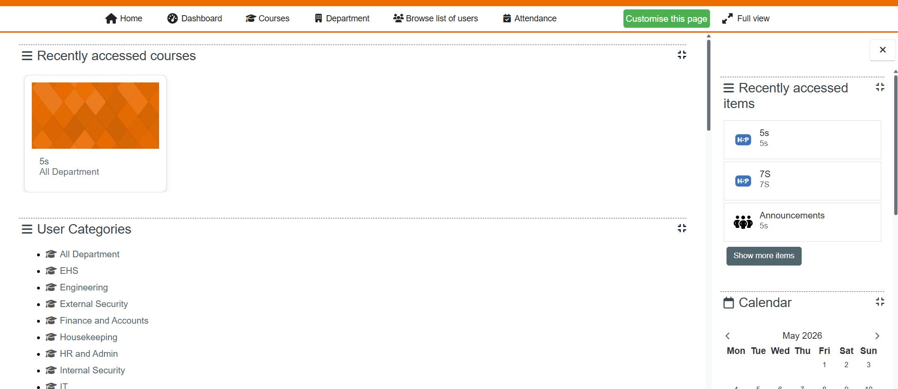
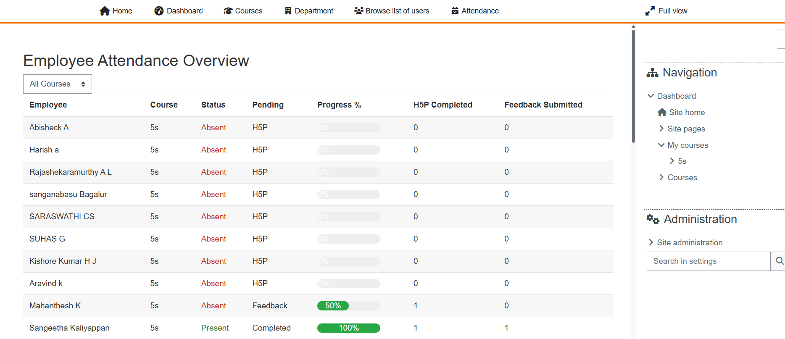
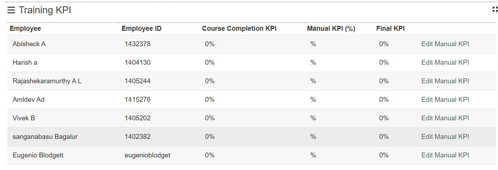
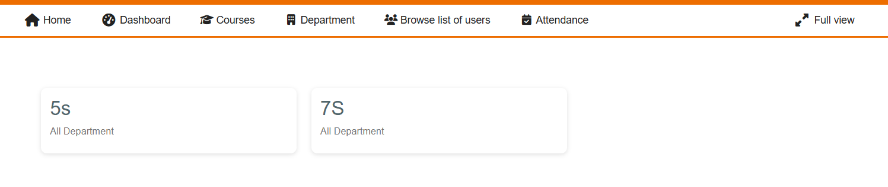

# Moodle Training Management System

A PHP + MySQL based training and learning management application inspired by Moodle workflows.

## Features

* Employee/student training management
* Attendance tracking
* Course video integration
* Training KPI dashboard
* Course completion tracking
* Search and reporting modules

## Technology Stack

* PHP
* MySQL
* JavaScript
* HTML/CSS
* Bootstrap

## Modules

* Attendance Management
* Video Course Tracking
* KPI Monitoring
* Training Reports
* User Progress Tracking

## Screenshots

### Dashboard

### Attendance Tracking

### KPI Dashboard

### Course Management

## Notes

This is a portfolio/demo project prepared for showcasing PHP/MySQL development skills.

Sensitive business logic, authentication modules, and confidential data have been excluded from the public version.
